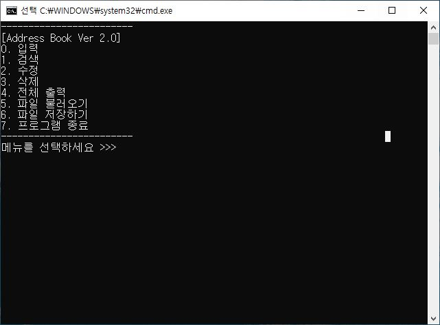
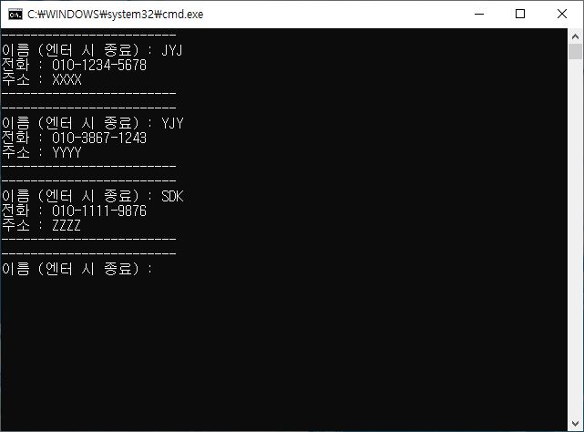
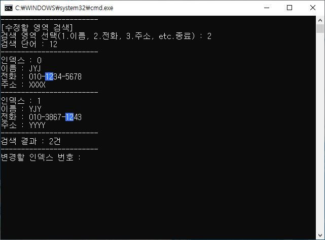
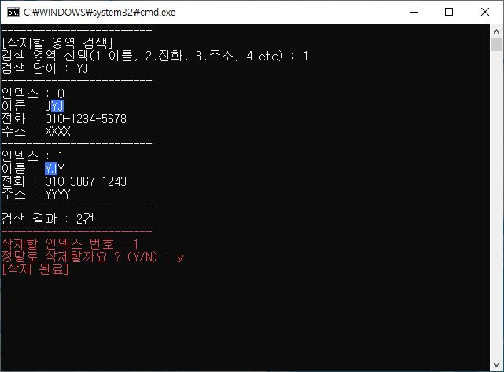

# C# 학습 리포지토리

PKNU C# 학습 리포지토리

------------------------
## 📕C# 기초

### 기본 자료형
[기본 자료형 정리](chap03)
### 형변환
[형변환 정리](chap03)
### 제어문
[제어문 정리](chap05)

------------------------
## 📙C# 객체 지향 문법

### 클래스
[클래스](chap07)
### 상속
[상속](chap07)
### 클래스 확장
[클래스확장](chap07)
### 인터페이스
[인터페이스](chap08)
### 프로퍼티
[프로퍼티](chap09)

------------------------
## 📗C# 추가 학습

### 제너릭과 컬렉션
[제너릭과 컬렉션](chap10)
### 예외 처리
[예외 처리](chap12)
### 대리자
[대리자](chap13)
### LINQ
[LINQ](chap15)
### 파일 다루기
[파일 다루기](chap18)
### 스레드
[스레드](chap19)
### 윈도우 폼 기초
[윈도우 폼 기초](chap20)

------------------------
## Project.1 (📑전화번호부 등록 콘솔 프로그램)
해당 프로그램은 전화번호부 리스트를 만들고 
리스트를 검색/수정/삭제/출력 해주는 기능을 가지고 있습니다. 
그리고 만들어진 리스트를 파일 형식으로 저장하거나 불러올 수 있습니다. 
(추가 기능으로 검색 시 일치 단어의 하이라이트 표시 기능을 제공합니다.)

>>  
>>__- 프로그램 시작 화면__
>     
>           
>     
>>  
>>__- 전화번호부 입력__
>   
>   
>     
>>  
>>**- 전화번호부 검색(하이라이트)**
>   
>         
>   
>>  
>>**- 전화번호부 삭제**
>   
>         
>   
>[(해당 프로젝트)](04_PROJECT)

## Project.2 (Winform 사칙연산 표현식 계산 프로그램)
List, Stack을 이용하여 중위(infix)식 구조에 연산자와 값을 분리하여 삽입하고 
후위(postfix)식 구조로 변환하여 계산하는 윈폼 계산기 입니다.  
- 기본 사칙연산, CE(Clear Entry) 제공 
- 정수, 실수 및 분수 값 형식 제공
- 괄호 우선순위 연산 제공
- 기본적인 예외 처리 제공
- 키보드 입력(버튼 대응) 제공

>>  
>>__- 프로그램 시작 화면__
>     
>           
>     
>>  
>>__- 전화번호부 입력__
>   
>   
>     
>>  
>>**- 전화번호부 검색(하이라이트)**
>   
>         
>   
>>  
>>**- 전화번호부 삭제**
>   
>         
>   
>[(해당 프로젝트)](04_PROJECT)

